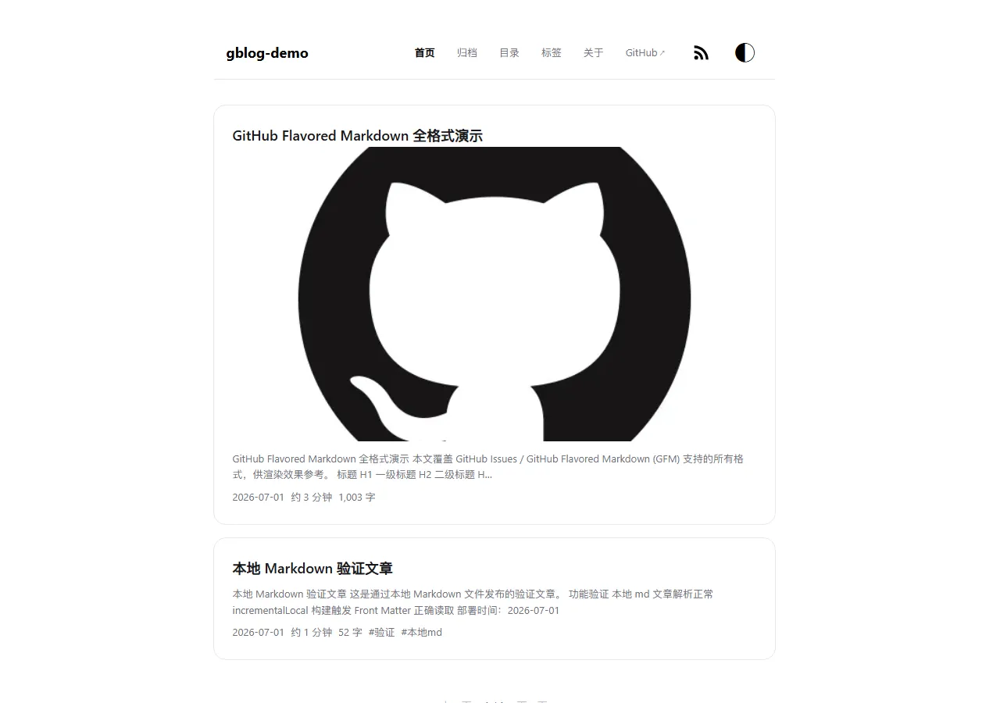
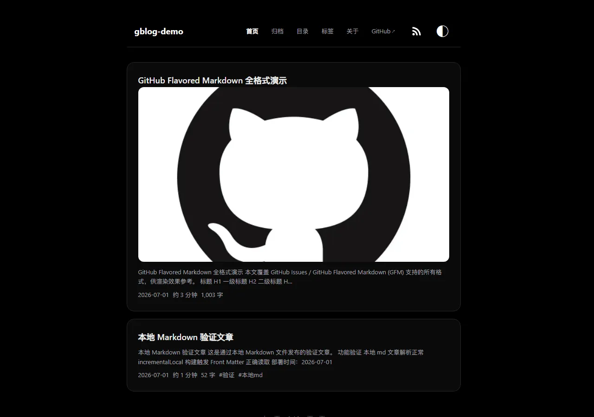
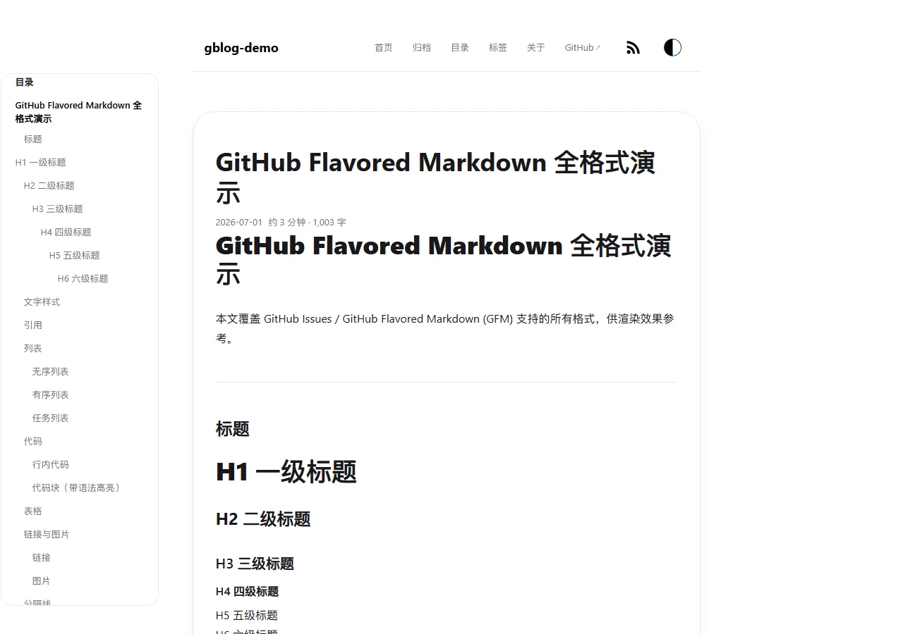
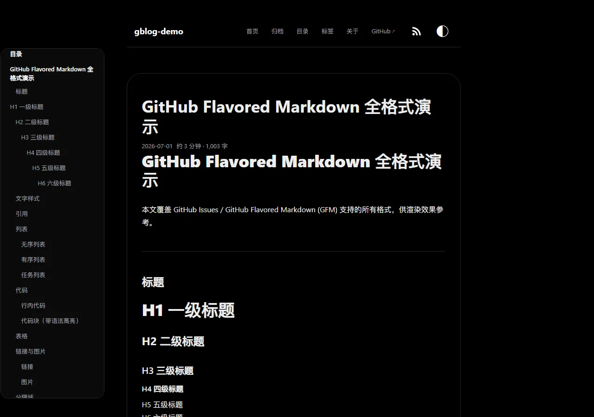

# gblog

**English** · [简体中文](README.zh-CN.md)

[Features](#features) · [Screenshots](#screenshots) · [Quick Start](#quick-start) · [Writing](#writing) · [Configuration](#configuration) · [Theme Guide](docs/THEME_GUIDE.md) · [Demo Site](https://night2049.github.io/gblog-demo/)

## Overview

A personal blog builder built entirely on the GitHub ecosystem.

**No servers or databases to maintain, no reliance on third-party services — write and manage your blog online with ease.**

Issues for writing and managing posts online

Actions for free builds

Pages for free hosting

giscus for free comments

Fully static, top-tier loading performance, responsive on mobile, no image host required, code highlighting, math formulas, table of contents, reading time, image transcoding, RSS, SEO, social cards, and custom themes.

> Build and development environment: **Bun ≥ 1.3.14**

## Screenshots

Captured from the [live demo site](https://night2049.github.io/gblog-demo/) (default theme).

|                     Light                     |                    Dark                     |
| :-------------------------------------------: | :-----------------------------------------: |
|  |  |
|  |  |

## Features

- **Dual-repo model**: Keep your privacy in a private repository, and deploy the content you want public in a public one.
- **Dual content sources**: Write posts with GitHub Issues, or import local Markdown files.
- **Online management**: Publish or unpublish posts directly through GitHub, without worrying about losing drafts.
- **Switchable themes**: Multiple built-in skins — switch with a one-line config change, and customize freely.
- **Content enhancements**: code highlighting, KaTeX formulas, table of contents (TOC), reading time, lazy image loading with WebP transcoding, image lightbox, and sharing.
- **Distribution and comments**: RSS / Atom / JSON Feed, plus giscus comments.
- **SEO and social**: OG / Twitter cards, canonical links, and JSON-LD structured data.

## Let AI Deploy It for You

Copy the following and hand it to your openclaw or hermes, and let the AI complete the deployment for you:
```
https://raw.githubusercontent.com/night2049/g-blog/refs/heads/main/gblog-deploy-verify/SKILL.md

Read this skill and help me complete the deployment.
```

## Quick Start

This project is a GitHub **template repository**. Use it to create your own private content repo, tweak a few config values, and go live — no local build required. The content repo (private) handles writing and building, while the site repo (public) hosts the GitHub Pages output.

1. **Create a private content repo from this template**: On the repository page, click **Use this template → Create a new repository**, and set Visibility to **Private**. Your posts, config, and build workflow all live here. (CLI equivalent: `gh repo create <your-content-repo> --template night2049/g-blog --private --clone`.)

2. **Create a public site repo**: Create a separate empty public repository (e.g. `you/blog`; the free tier of GitHub Pages only supports public repos) to hold the generated site. In its Settings → Pages, set the source to `Deploy from a branch` (branch `main`, root directory).

3. **Wire up the push**: Allow the content repo to push its output to the site repo.
   - Generate a key locally: `ssh-keygen -t ed25519 -f deploy_key -N ""`
   - Add the public key `deploy_key.pub` to the site repo under Settings → Deploy keys, and check *Allow write access*
   - Add the private key `deploy_key` to the content repo under Settings → Secrets and variables → Actions, named `BLOG_DEPLOY_KEY`
   - Edit `.github/workflows/build.yml` in the content repo and change `repository: your-name/your-site-repo` to your site repo

4. **Update the config** (under `config/`, at minimum these):
   - `site.json`: `title`, `url` (the site's final address, e.g. `https://you.github.io/blog`), `author`
   - `appearance.json`: `logo`, `links`, `footer` (replace the sample ICP / public-security filing with your own, or leave them empty)

5. **Write your first post**: Create a new Issue in the content repo. The title becomes the post title, and the body is Markdown. Add the `published` label. Actions builds automatically and pushes to the site repo, and GitHub Pages goes live shortly after.

> When the content repo is private, GitHub attachment images pasted into issues are first resolved through GitHub's Markdown API into signed media URLs, then downloaded anonymously; the build does not send a token directly to the image CDN. The workflow uses the current `GITHUB_TOKEN` by default. If your permission model prevents the Markdown API from reading private content, add `CONTENT_PAT` as an Actions Secret fallback. Keep all secrets in Actions Secrets only, and never commit them to the repository.

## Writing

Create a new GitHub Issue in your private repo: the title becomes the post title, and the body is Markdown. Add the `published` label to publish; close the issue or remove the `published` label to unpublish.

Other labels on the issue become post tags, and labels starting with `dir:` (e.g. `dir:essays`) generate directories. Images pasted into the body are downloaded to the site at build time; private GitHub attachments use the signed-URL Markdown API flow described above.

> Local Markdown is also supported: just drop `.md` files into the `content/` directory. This suits those who prefer writing locally — see the [Local Markdown Guide](docs/LOCAL_MARKDOWN_GUIDE.md).

## Configuration

Configuration lives under `config/`, merged and validated by `loadConfig`. `site.json` and `build.json` are required.

<details>
<summary>Configuration field reference</summary>

#### site.json (required)

| Field | Required | Meaning | Default / Consequence |
| --- | --- | --- | --- |
| `title` | Yes | Site title | Errors if missing |
| `description` | No | Site description (SEO fallback) | Empty string |
| `author` | No | Author name | Empty string |
| `url` | Required when RSS is enabled | Site's absolute address (used for absolute links / canonical / feed) | Errors when feed is enabled if empty; OG / canonical / JSON-LD gracefully omitted |
| `language` | No | `<html lang>` | `zh-CN` |

#### build.json (required; includes build and pagination)

`build` section:

| Field | Required | Meaning | Default |
| --- | --- | --- | --- |
| `publishedLabel` | Yes | Publish label name (an issue goes live only if it has this label and is open; non-draft local md gets it automatically) | None |
| `metaMarker` | Yes | Marker for the meta comment block in the body | None |
| `pageLabel` | Yes | Standalone page label name | None |
| `dirPrefix` | Yes | Directory label prefix (e.g. `dir:essays`) | None |
| `postDir` | No | Output directory for post pages | `post` |
| `contentDir` | No | Root directory for local md content | `content` |
| `excludedLabels` | No | Additional labels to exclude | `[]` |

`pagination` section: `home` / `archive` / `directory` / `tag` each set the items per page, and must be positive integers.

#### appearance.json (optional; defaults to the default theme)

| Field | Meaning | Default |
| --- | --- | --- |
| `theme.name` | Theme folder name (`themes/<name>`) | `default` |
| `theme.skin` | Skin token filename (without `.css`); an empty string uses the theme's `defaultSkin` | Empty string |
| `logo.type` | `text` or `image` | `text` |
| `logo.value` | Text content or image URL | Site title |
| `links[]` | External links at the end of the nav (`label` + `href`; `href` must be http(s)) | `[]` |
| `footer.copyright` / `icp` / `police` / `policeCode` | Footer copyright, ICP / public-security filing text and numbers | Empty |

To switch themes, change only `theme.name` / `theme.skin`; for deep customization, see the [Theme Guide](docs/THEME_GUIDE.md).

#### content.json (feature enhancement toggles, optional)

Each item can be toggled independently, with range validation on numeric values.

| Field | Meaning | Default |
| --- | --- | --- |
| `toc` | Table of contents: not rendered when headings are fewer than `minHeadings`; collapsed on desktop when items are fewer than `pcCollapseBelow` | on / 2 / 5 |
| `readingTime` | Reading time: `cpm` Chinese characters/min, `wpm` English words/min | on / 400 / 250 |
| `summary` | Card / SEO summary length | on / 120 |
| `cover` | First-image thumbnail on list cards | on |
| `math` | KaTeX math formulas | on |
| `codeCopy` | Code copy button | on |
| `imageZoom` | Image lightbox | on |
| `share` | Sharing; `networks` is a whitelist (copy/x/telegram/weibo/facebook/linkedin/reddit/whatsapp/email) | on / copy,x,telegram,weibo |
| `widgets` | Back to top / back to home / reading progress | on |
| `og` | OG / social card meta | on |
| `canonical` | canonical link | on |
| `jsonLd` | JSON-LD structured data | on |
| `webp` | Convert images to WebP; `quality` 1-100 | on / 80 |
| `errorPages.codes` | HTTP codes of the generated error pages (100-599) | [404,403,500] |

#### feed.json (optional; disabled by default)

| Field | Meaning | Constraint |
| --- | --- | --- |
| `enabled` | Whether to generate a feed | Boolean |
| `formats` | Output formats | When `enabled`, must be a non-empty subset of `rss`/`atom`/`json` |
| `count` | Include the latest N posts | Positive integer |
| `summaryLength` | >0 uses a summary, =0 uses the full text | Integer ≥ 0 |

`site.url` is required when the feed is enabled.

#### comments.json (optional; disabled by default)

| Field | Meaning |
| --- | --- |
| `enabled` | Whether to enable giscus comments |
| `repo` | Comment repo `owner/repo` |
| `repoId` | giscus repository ID (generated by giscus.app; a public value) |
| `category` | Discussion category name |
| `categoryId` | Category ID (a public value) |
| `mapping` | Mapping method (defaults to `pathname`) |

`repoId` and `categoryId` are generated at [giscus.app](https://giscus.app); they are public values, not secrets.

</details>
